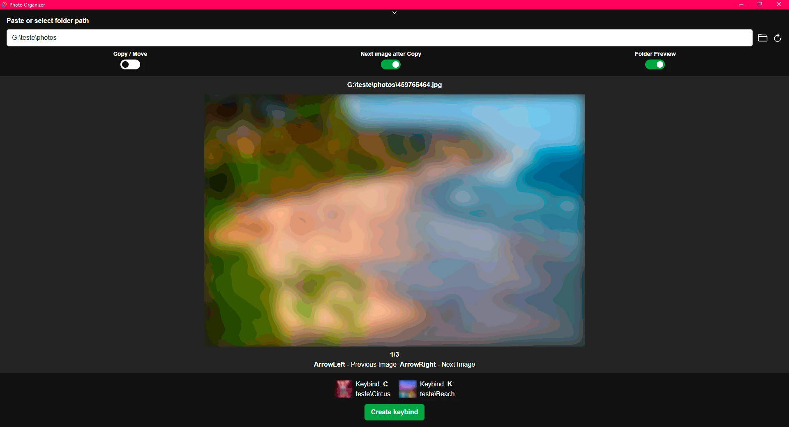

# Photo Organizer

Organize your photos choosing destination folder with keybinds.




## 🚀 Installation

Clone Repository:

```shell
git clone https://github.com/Lucas8x/photo-organizer.git
```

Enter project folder:

```shell
cd photo-organizer
```

Install dependencies

```shell
npm install
```

Start project with:

```shell
npm run start
```

## 📝 License

This project is under [MIT](./LICENSE) license.
